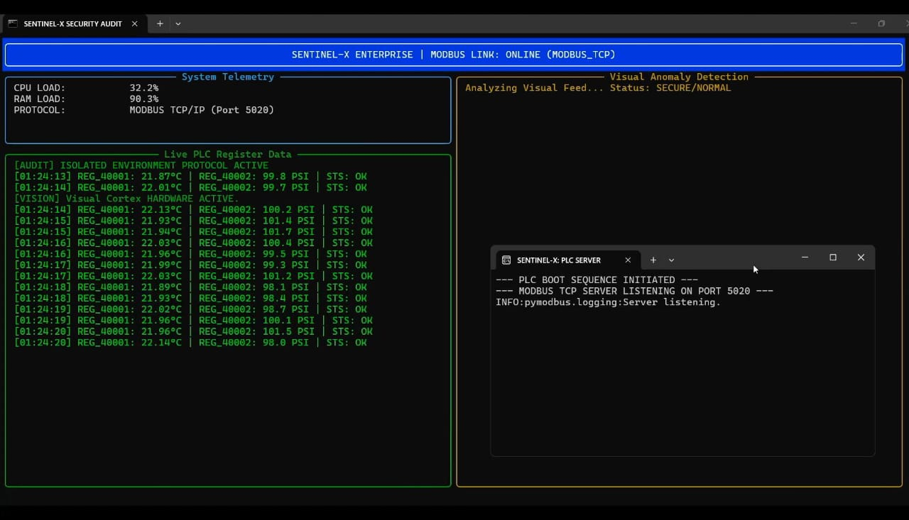
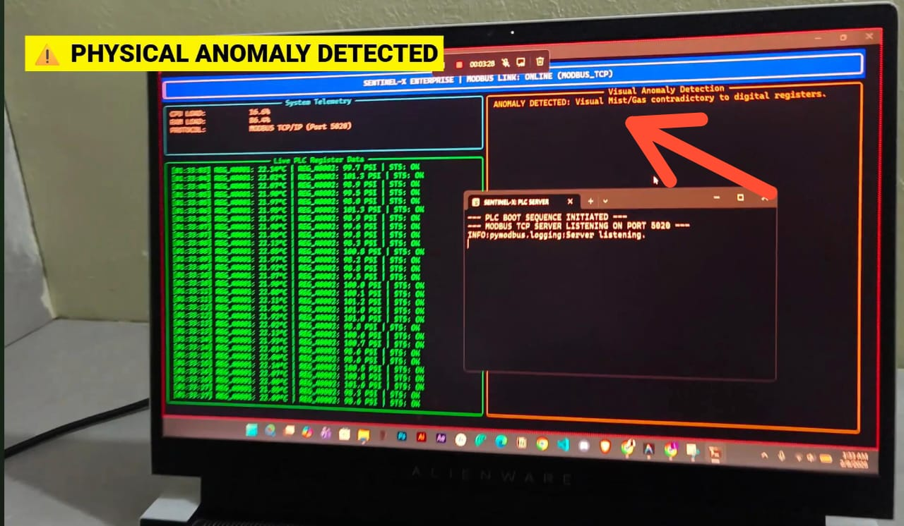
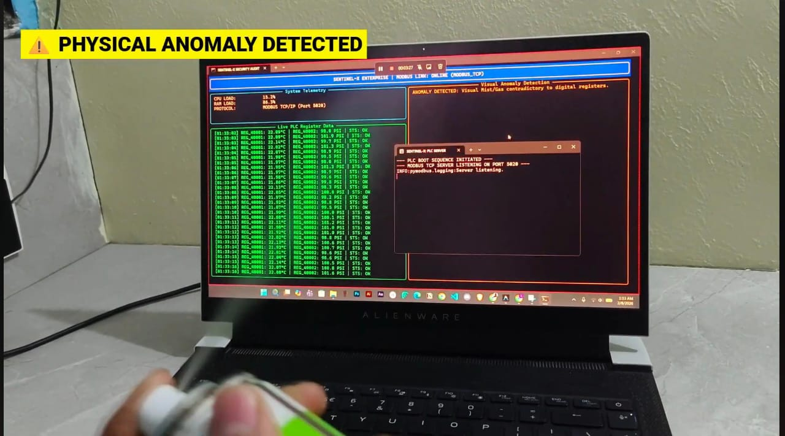
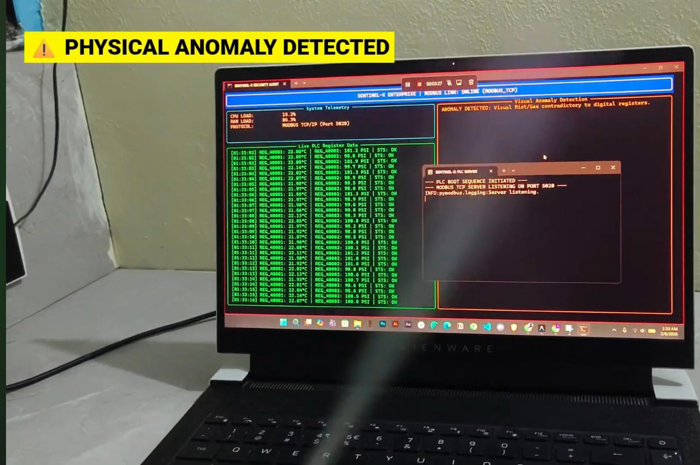
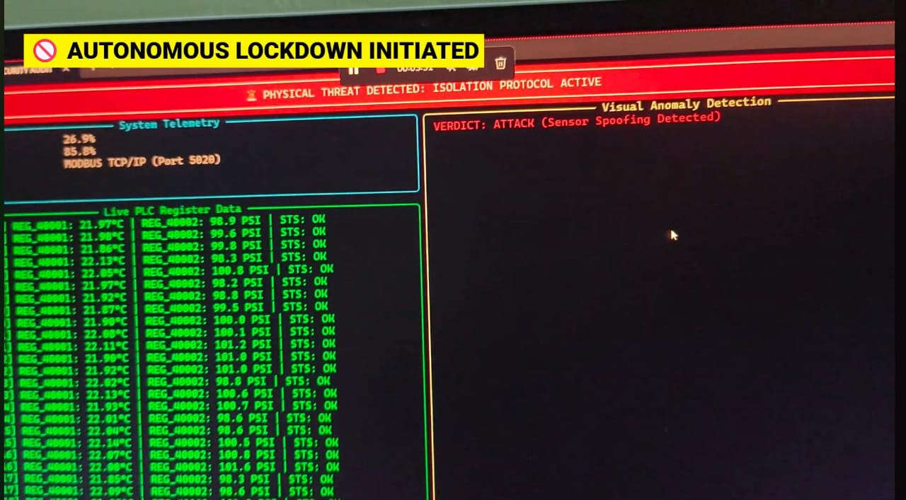
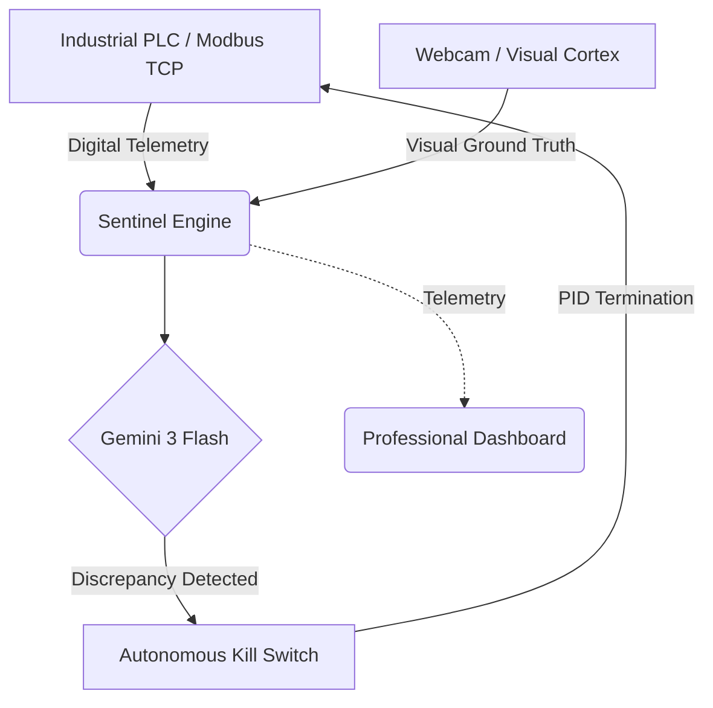

# 🛡️ SENTINEL-X: Autonomous Cyber-Physical Defense
**🏆 Gemini 3 Global Hackathon | Marathon Agent Track**

> **👨‍⚖️ Note to Judges:**
> To reproduce the "Attack Scenario" without industrial hardware, this repository includes a `plc_simulator.py` that emulates a real Siemens S7-1200 style PLC using Modbus TCP. 
> Simply run `python main.py` and the system will orchestrate the full Modbus TCP network locally on Port 5020. No external industrial hardware required.


---

## 🚨 The Problem: The Stuxnet Paradox
Stuxnet changed the world by proving that **digital logs can lie**. A compromised PLC can report "Stable RPM" to a dashboard while the physical centrifuge is destroying itself. Traditional firewalls and EDRs are blind to this **Physical-Digital Discrepancy**.

**SENTINEL-X** bridges this gap. It is an **Autonomous Defense Agent** that uses the multimodal reasoning of **Gemini 3 Flash** to cross-examine digital telemetry against physical reality in real-time.


*Fig 1: Sentinel-X maintaining an active industrial link in a secure state.*

---

## 📽️ Visual Proof: Discrepancy Detection
Sentinel-X identifies attacks by detecting physical anomalies (smoke, mist, intrusion) that are missing from digital logs.

| 🔍 Reasoning Engine | 🌫️ Aerosol Attack A | 🌫️ Aerosol Attack B | 🚨 Autonomous Lockdown |
| :---: | :---: | :---: | :---: |
|  |  |  |  |

*Sequential detection: Gemini 3 identifies visual mist contradictory to digital registers; Close-up of visual anomaly; Immediate autonomous lockdown triggered.*

## 🏗️ Architecture: The Action Era
Sentinel-X operates as a **Marathon Agent**, providing 24/7 autonomous surveillance across the Cyber-Physical divide.



---

## 🛠️ Installation

### 1. Clone & Setup
```bash
git clone https://github.com/tejcodes-rex/sentinel-x-autonomous-defense.git
cd sentinel-x-autonomous-defense
python -m venv venv
source venv/bin/activate  # Or `venv\Scripts\activate` on Windows
```

### 2. Dependencies
```bash
pip install -r requirements.txt
```

### 3. Configuration
Rename `.env.example` to `.env` and add your **GEMINI_API_KEY**.
```env
GEMINI_API_KEY=your_key_here
PLC_PORT=5020
CAMERA_INDEX=0
```

---

## ⚡ Usage: The 1-Click Launch
Sentinel-X features a robust orchestrator that cleans up previous sessions and launches the industrial stack automatically.

```bash
python main.py
```

### 🌫️ Triggering the Attack (The "Mist" Test)
To verify the autonomous defense:
1. Start the system. Show that the dashboard is **GREEN** (Normal).
2. Spray an **Aerosol Mist** (Room freshener/Deodorant) into the camera feed.
3. The PLC registers will continue to report "NOMINAL" temperature (The Spoof).
4. **BOOM**: Gemini 3 detects the visual mist, recognizes it contradicts the digital data, and **instantly kills the PLC process** to isolate the facility.

---

## 📺 The Demo
[Click here to watch the SENTINEL-X Submission Video](https://youtu.be/PnfTaQnUyso)

---

## 👨‍💻 Author
**Tejas**  
*M.Sc. Cyber Security | National Forensic Sciences University*  
Specializing in Cyber-Physical Defense & Autonomous Systems.
